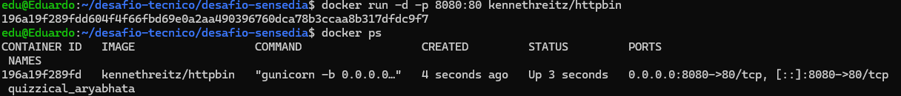
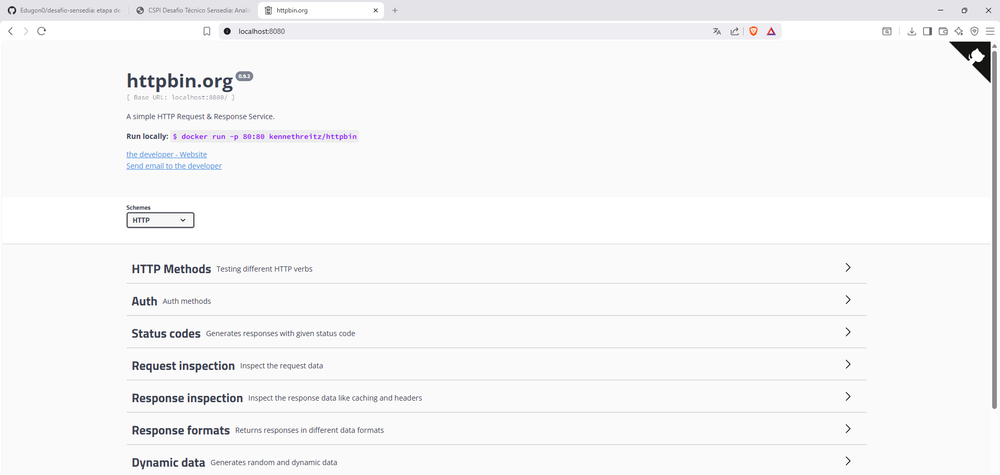
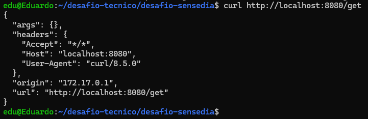
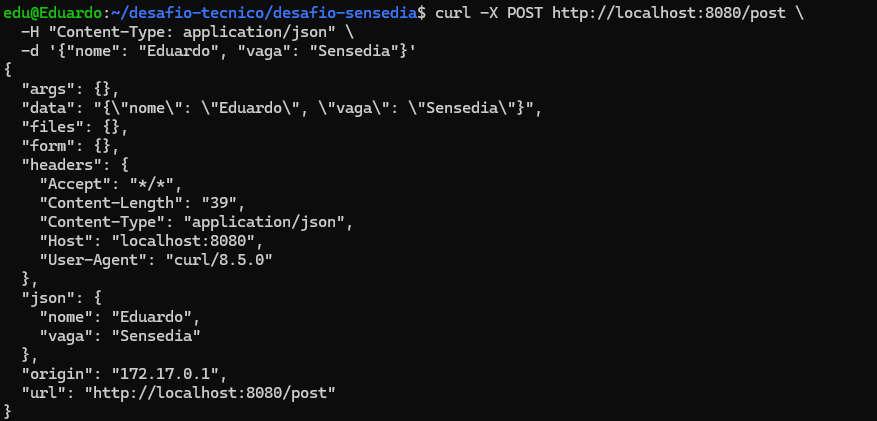
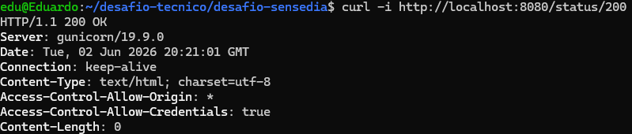
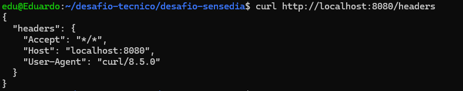

# Desafio Técnico Sensedia — Analista de Suporte a Infraestrutura Jr

## Objetivo
Disponibilizar a aplicação httpbin em ambiente local utilizando Docker
e validar seu funcionamento através de requisições HTTP.

## Tecnologias utilizadas
- Docker
- Git
- curl

## Processo

### 1. Subindo a aplicação
```bash
docker run -d -p 8080:80 kennethreitz/httpbin
```

### 2. Verificando o container
```bash
docker ps
```


### Execução do httpbin



## Testes realizados

### Teste 1 — GET simples
```bash
curl http://localhost:8080/get
```


### Teste 2 — POST com dados
```bash
curl -X POST http://localhost:8080/post \
  -H "Content-Type: application/json" \
  -d '{"nome": "Eduardo", "vaga": "Sensedia"}'
```


### Teste 3 — Verificar status HTTP
```bash
curl -i http://localhost:8080/status/200
```


### Teste 4 — Ver headers da requisição
```bash
curl http://localhost:8080/headers
```


## Como reproduzir

### Usando docker run
```bash
docker run -d -p 8080:80 kennethreitz/httpbin
```

### Usando docker-compose
```bash
docker-compose up -d
```

Acesse em: http://localhost:8080